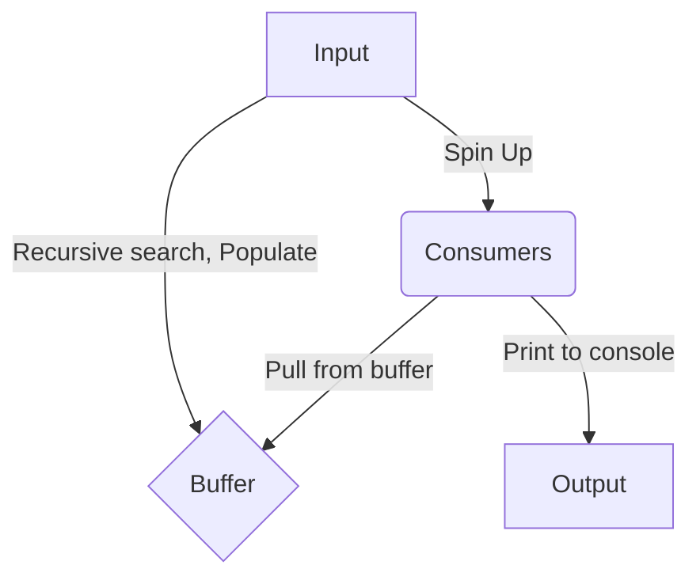

**Dependencies:**

A compiler with support for C++20
CMake version 3.28.3
Catch2 v3.7.1 for unit testing. Cmake will auto fetch and build this for you.

**Build instructions:**

```
#cd into project dir
# make build directory if doesn't already exist
mkdir build
cd build
# generate cmake files
cmake ..
# compile
cmake --build .
```

**Testing instructions:**

```
cd build
cmake ..
cmake --build .
ctest --verbose
```

**Usage Instructions:**

```
./grep-file-search "ITEM_IM_SEARCHING_FOR" ~/
```

**Application goal**

Example usage:
Search all files under the home directory for the specified string
```
./grep-file-search "hiya" ~/
```

**Application design**

Use a spmc(single producer multiple consumer) buffer and all hardware threads to 
recursively search for a specified string in all files within the specified directory.

Main thread recursively searches the specified directory generating a list of all 
entries to grep through and places all those in a buffer.

The rest of the available threads the platform has will pull entries from the buffer
in parallel and print out any matches to stdout. C++ cout is synchronized by default 
so no need to worry about interleaving of charactsers.

**Design diagrams**
To view use a md viewer with support for mermaid diagrams:
Vs code plugin: Markdown Preview Mermaid Support, Mac: Markchart, or view using: https://mermaid.live

Workflow:

